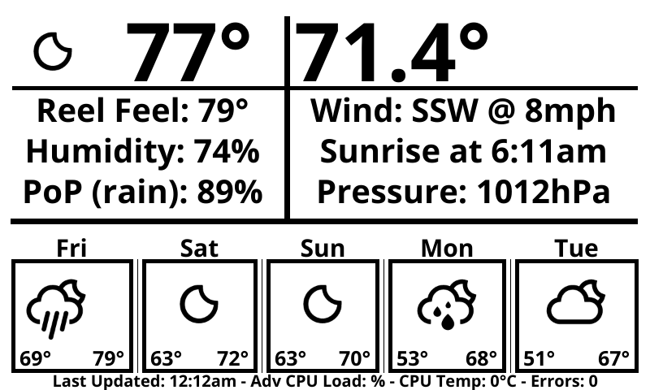

Thermostat
===========

This repository does not (currently) implement a thermostat.

It provides:

  * The software to run a simple weather station.
  * A (mostly) text based display output:

Table of Contents:

  * [About](#about)
  * [Compiling from Source](#compiling-from-source)
  * [Contributing](#contributing)
  * [License](#license)

About
-----

I originally set out to make a smart thermostat with a weather station build into it. However, relays were never ordered with the display and the thermostat idea was tabled for now. Here is a list of the hardware that was chosen to create the weather station:

  * [WaveShare 7.5" E-Ink Display](www.waveshare.com/7.5inch-e-paper-hat.htm) - I chose this display to minimize the power draw of the system. Color and refresh rate aren't a problem, as the data doesn't refresh very often anyways.
  * [Raspberry Pi Zero W](https://www.raspberrypi.org/products/raspberry-pi-zero-w) - This was used for it's simplicity, affordability, and because our display came with a rPi hat.
  * [Texas Instruments Temperature Sensor (TMP117)](https://www.ti.com/product/TMP117) - I wanted to be able to read out temperature with a reasonable degree of accuracy that many cheap hobbyist sensors didn't allow for. *Insert overkill sensor here*
  * [OpenWeather's One Call API](https://openweathermap.org/api/one-call-api) - This was the first API I found that was free and had current data for my location.

The setup is pretty simple... Solder the TMP117 to the rPi's I2C pins, plug the display into the rPi, and configure a cronjob/similar to run this program on boot.

Documentation:

  * [Weather API Documentation](https://openweathermap.org/api/one-call-api)
  * [WaveShare Display Documentation](7.5inch_e-Paper_V2_Specification.pdf) - [Source](https://www.waveshare.com/w/upload/6/60/7.5inch_e-Paper_V2_Specification.pdf)
  * [Temperature Sensor Documentation](tmp117.pdf) - [Source](https://www.ti.com/lit/ds/symlink/tmp117.pdf)

Compiling from Source
------------

If you're looking to compile from source, you'll need the following:

  * [Go](https://golang.org) installed and [configured](https://golang.org/doc/install)
  * A [Raspberry Pi Zero W](https://www.raspberrypi.org/products/raspberry-pi-zero-w) and [WaveShare 7.5" E-Ink Display](www.waveshare.com/7.5inch-e-paper-hat.htm) or commenting out the waveshare package calls in [main.go](main.go)
  * An [OpenWeatherMap API Key](https://home.openweathermap.org/users/sign_up)
  * A [TMP117 Temperature Sensor](https://www.ti.com/product/TMP117) if you want local temperature readings
  * Some patience, as this repository isn't really intended for public use. (There may be unnoticed bugs/random rough edges)

In order to cross comile this from windows to your raspberry pi, you'll have to run the following commands before building:

  * `set GOOS=linux`
  * `set GOARCH=arm`
  * `set GOARM=5`

Then, build the project.

  * `go build ./`

Simply upload everything to your raspberry pi, and you're done!

PS- You may want to add the binary to crontab/similar, so it runs on startup.

Contributing
------------

Contributions are always welcome. If you're interested in contributing, send me an email or submit a PR.

License
-------

This project is currently licensed under GPLv3. This means you may use our source for your own project, so long as it remains open source and is licensed under GPLv3.

Please refer to the [license](/LICENSE) file for more information.
